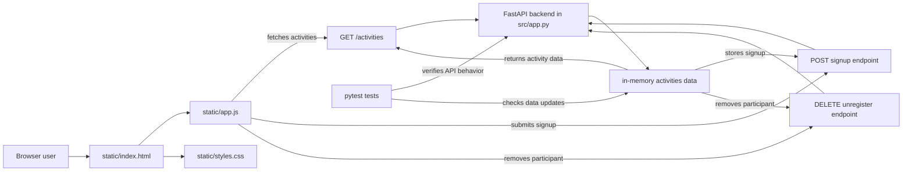

# Architecture

This diagram reflects the project structure and runtime flow in the repository:

- The browser loads the static HTML, CSS, and JavaScript.
- The frontend JavaScript calls the FastAPI backend routes.
- The backend reads and updates the in-memory `activities` dataset in `src/app.py`.
- The pytest suite validates the API endpoints and their behavior.
